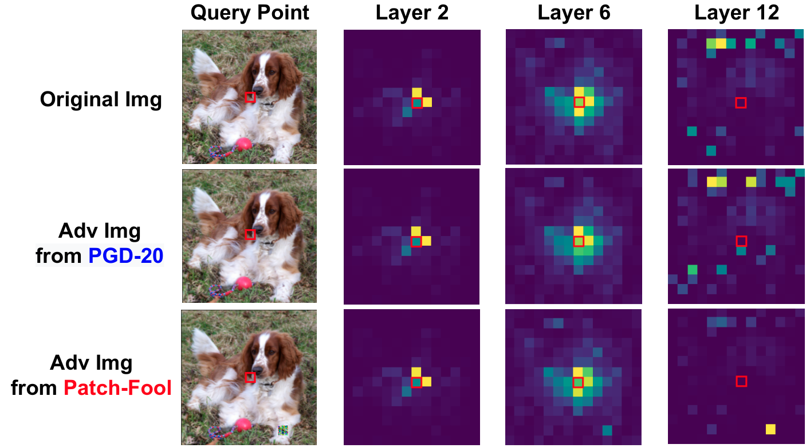

# Patch-Fool: Are Vision Transformers Always Robust Against Adversarial Perturbations?
Yonggan Fu, Shunyao Zhang, Shang Wu, Cheng Wan, Yingyan Lin

Accepted at ICLR 2022 [[Paper Link](https://openreview.net/forum?id=28ib9tf6zhr)].

## Overview

- We propose a new attack framework, dubbed *Patch-Fool*, aiming to fool the self-attention mechanism by attacking the basic component (i.e., a single patch) participating in self-attention calculations.
    
- We evaluate the robustness of both ViTs and CNNs against our *Patch-Fool* attack with extensive experiments and find that ViTs are consistently less robust than CNNs across various attack settings.
    
- We further benchmark the robustness of both ViTs and CNNs under two variants of *Patch-Fool*, i.e., *Sparse Patch-Fool* and *Mild Patch-Fool*, and discover that the perturbation density and the perturbation strength highly influence the robustness ranking between ViTs and CNNs, where our Patch-Fool is an extreme case of high perturbation density and strength. 

<p align="center">
  
</p>

## Visualization

We visualize the adversarial examples generated by Patch-Fool’s variants below, including *Patch-Fool* with different number of perturbed patches (rows 2∼3), *Sparse Patch-Fool* with a total of 250 perturbed pixels distributed in different number of perturbed patches (rows 4∼6), and *Mild Patch-Fool* under L2 and Linf constraints (rows 7∼8). The corresponding robust accuracy is also annotated.

<p align="center">
  
</p>

## Code Usage
Our codes support the *Patch-Fool* attack on top of SOTA Vision Transformers (e.g., DeiT-Ti, DeiT-S, and DeiT-B) and CNNs on ImageNet validation dataset.

### Prerequisites
The required packages are listed in ```env.txt```.

### Key parameters
```--data_dir```: Path to the ImageNet folder.

```--dataset_size```: Evaluate on a part of the whole dataset.

```--patch_select```: Select patches based on the saliency map, attention map, or random selection.

```--num_patch```: Number of perturbed patches.

```--sparse_pixel_num```: Total number of perturbed pixels in the whole image.

```--attack_mode```: Optimize Patch-Fool based on the final cross-entropy loss only, or consider both cross-entropy loss and the attention map.

```--attn_select```: Select patches based on which attention layer.

```--mild_l_2```: Add L2 constraints on perturbed pixels.

```--mild_l_inf```: Add Linf constraints on perturbed pixels.


### Evaluate Patch-Fool
We provide the following examples to evaluate the three variants of *Patch-Fool*, i.e., the vanilla *Patch-Fool*, *Sparse Patch-Fool*, and *Mild Patch-Fool*: 

- To Evaluate  vanilla *Patch-Fool*:

```
python main.py --network DeiT-T --patch_select Attn --num_patch 1 --sparse_pixel_num 0 --attack_mode Attention
```

- To Evaluate *Sparse Patch-Fool*:

```
python main.py --network DeiT-T --patch_select Attn --num_patch 1 --sparse_pixel_num 250 --attack_mode Attention
```

- To Evaluate *Mild Patch-Fool* with Linf constraints: 


```
python main.py --network DeiT-T --patch_select Attn --num_patch 1 --sparse_pixel_num 0 --attack_mode Attention --mild_l_inf 0.1
```

## Citation
```
@inproceedings{fu2021patch,
  title={Patch-Fool: Are Vision Transformers Always Robust Against Adversarial Perturbations?},
  author={Fu, Yonggan and Zhang, Shunyao and Wu, Shang and Wan, Cheng and Lin, Yingyan},
  booktitle={International Conference on Learning Representations},
  year={2021}
}
```
